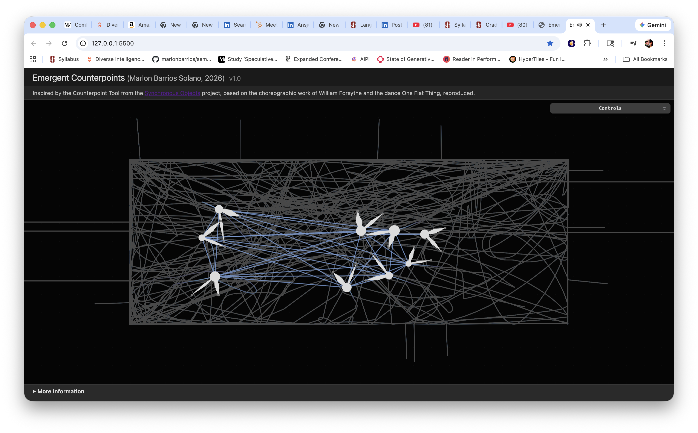
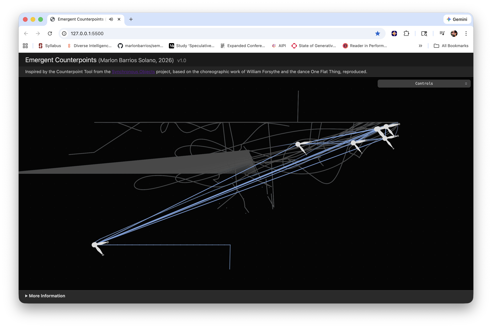
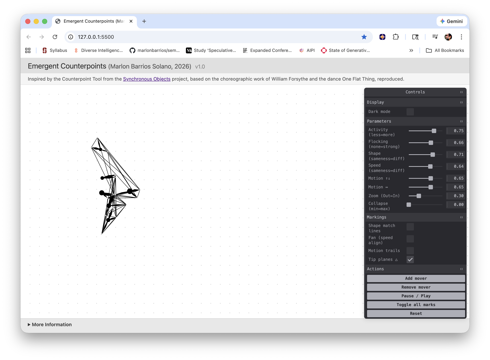
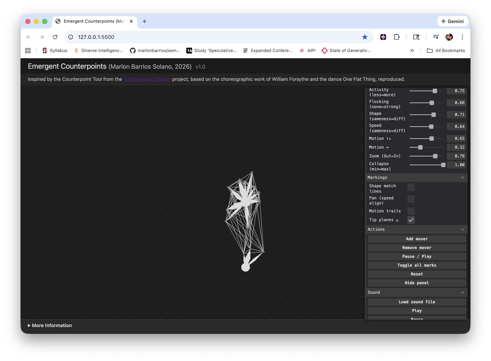

# Emergent Counterpoints

**Emergent Counterpoints** is an interactive web application that explores alignment and counterpoint through animated “movers” on a stage. It is a p5.js reimagining of the original Counterpoint Tool from the Synchronous Objects project, created after the original Flash-based tool was deprecated.

This project was created **for educational and research purposes**, exploring procedural choreography, computational aesthetics, and the visualization of choreographic counterpoint.

**Marlon Barrios Solano, 2026** · v1.0  

Live:  
https://marlonbarrios.github.io/emergent_counterpoints/

---

# Screenshots

| one | two |
|-----|-----|
|  |  |
| three | four |
|  |  |

---

# About

The project is inspired by the **Counterpoint Tool** from the **Synchronous Objects** project, based on the choreographic work *One Flat Thing, reproduced* by **William Forsythe**.

A procedural algorithm drives the motion of animated entities called **movers**. Each mover has three arms rotating at clock-face positions and at different speeds. Users shape relationships of unison and difference in:

- shape
- speed
- motion

Visual markings such as **shape matches, speed fans, motion trails, and tip planes** reveal patterns of alignment and divergence, allowing users to construct visual counterpoint structures.

This reimplementation recreates the conceptual spirit of the original Flash tool using contemporary web technologies so it can continue to serve as a **learning and exploration environment for choreographic structures, generative systems, and computational performance studies**.

---

# Note from the Author

This project was created in **just a few hours of hacking and experimentation** as a small tribute to the extraordinary **Synchronous Objects** project.

When the original Counterpoint Tool disappeared after the deprecation of Flash, I found it surprising that such an **important and visionary project in choreographic computation and digital humanities** no longer had a working interactive version.

The original work remains one of the most inspiring examples of how choreography, computation, visualization, and research can intersect. This lightweight reinterpretation was created simply to make a similar exploratory experience accessible again using modern web technologies.

It should be understood as **a pedagogical and experimental homage**, not a replacement for the original project.

---

# How to Run

## 1. Load the App

Open `index.html` in a modern web browser.

Supported browsers:

- Chrome
- Firefox
- Safari
- Edge

No server or build step is required.

---

## 2. Controls

Use the **Controls panel** located in the top-right corner.

The panel can be:

- collapsed
- hidden
- restored with the floating **Show panel** button

The stage occupies the full browser window, and movers remain within a **75px margin** from the screen edges.

---

## 3. Sound (Optional)

Use the **Sound folder controls**:

- Load sound file
- Play
- Pause
- Restart
- Stop

---

## 4. Auto Performance

Enable **Auto performance** to let the system run autonomously with the music.

When enabled, the application will:

- start audio playback
- vary the number of movers (1–10)
- change markings over time
- modulate zoom and collapse
- vary shape and speed
- adjust flocking and motion parameters

When disabled:

- music stops
- the user regains full manual control.

---

# Technical Stack

- **p5.js**
- **Tweakpane**
- **HTML5 Audio API**
- **Vanilla JavaScript**
- **CSS**

No build step required.

---

# Credits

## Emergent Counterpoints

Concept, design, and implementation  
**Marlon Barrios Solano (2026)**

---

## Synchronous Objects Project

*Synchronous Objects for One Flat Thing, reproduced* (2009)

Creative Direction

- William Forsythe  
- Maria Palazzi  
- Norah Zuniga Shaw  

Generative Design

- Matthew Lewis  

Research Collaborators

- Scott deLahunta  
- Patrick Haggard  
- Alva Noë  

Dance Research Collaborators

- Jill Johnson  
- Christopher Roman  
- Elizabeth Waterhouse  

Institutions

- Advanced Computing Center for the Arts and Design (ACCAD)
- Ohio State University Department of Dance
- The Forsythe Company

Project website  
https://synchronousobjects.osu.edu/

---

# License

MIT License

Copyright (c) 2026  
Marlon Barrios Solano

Permission is hereby granted, free of charge, to any person obtaining a copy of this software and associated documentation files to deal in the Software without restriction.
